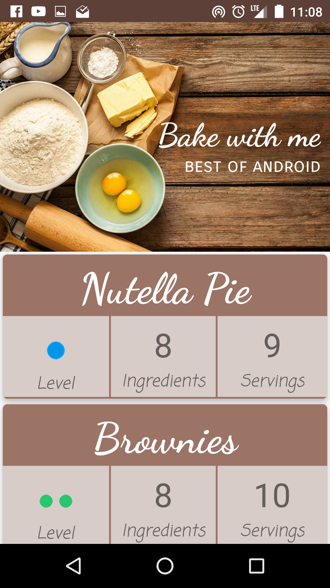
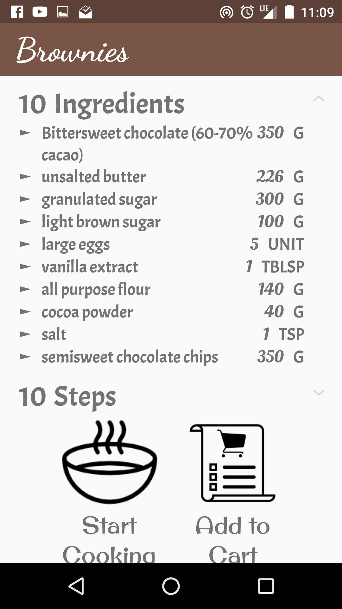
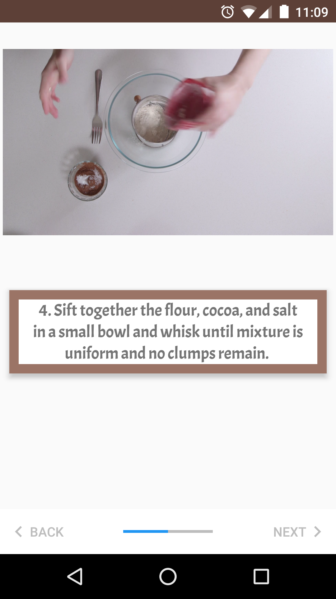
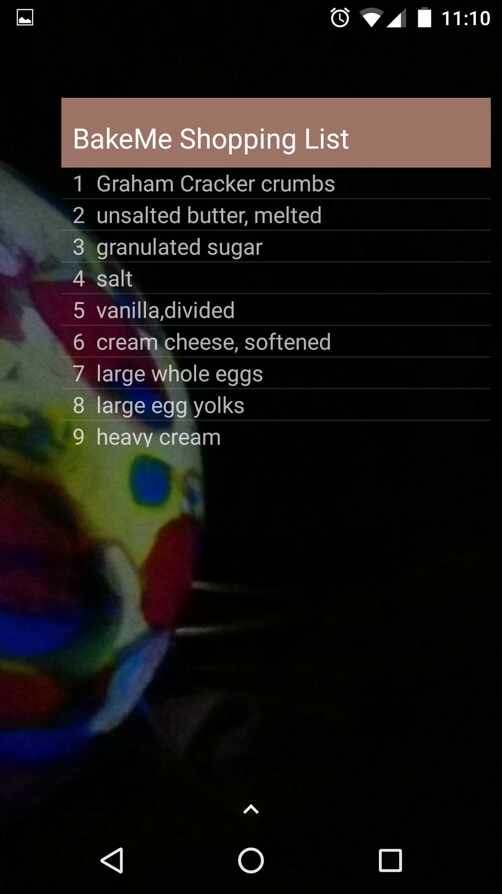

# BakeMe

## Introduction
App for Android Developer Nanodegree program. Android Baking App that will allow Udacity’s resident baker-in-chief,  
Miriam, to share her recipes with the world. You will create an app that will allow a user to select a recipe and see  
video-guided steps for how to complete it.

## Overview
Productionizing an app, taking it from a functional state to a production-ready state. Involve finding and handling error cases,  
adding accessibility features, allowing for localization, adding a widget, and adding a library. 

## Rubric
### General App Usage
- [x] App should display recipes from provided network resource.
- [x] App should allow navigation between individual recipes and recipe steps.
- [x] App uses RecyclerView and can handle recipe steps that include videos or images.
- [x] App conforms to common standards found in the Android Nanodegree General Project Guidelines.

### Components and Libraries
- [x] Application uses Master Detail Flow to display recipe steps and navigation between them.
- [x] Application uses Exoplayer to display videos.
- [x] Application properly initializes and releases video assets when appropriate.
- [x] Application should properly retrieve media assets from the provided network links. It should properly handle network requests.
- [x] Application makes use of Espresso to test aspects of the UI.
- [x] Application sensibly utilizes a third-party library to enhance the app's features. That could be helper library to interface with Content Providers if you choose to store the recipes, a UI binding library to avoid writing findViewById a bunch of times, or something similar.

### Homescreen Widget
- [x] Application has a companion homescreen widget.
- [x] Widget displays ingredient list for desired recipe.

## Screenshots
    

## Sources
* [Stepstone stepper](https://github.com/stepstone-tech/android-material-stepper)  
* [Timber](https://github.com/JakeWharton/timber)
* [ExoPlayer](https://github.com/google/ExoPlayer)
* [Picasso](http://square.github.io/picasso/)
* [Parceler](https://github.com/johncarl81/parceler)

## License
Copyright 2017 BakeMe

Licensed under the Apache License, Version 2.0 (the "License"); you may not use this file except in compliance with the License. You may obtain a copy of the License at

    http://www.apache.org/licenses/LICENSE-2.0

Unless required by applicable law or agreed to in writing, software distributed under the License is distributed on an "AS IS" BASIS, WITHOUT WARRANTIES OR CONDITIONS OF ANY KIND, either express or implied. See the License for the specific language governing permissions and limitations under the License.

